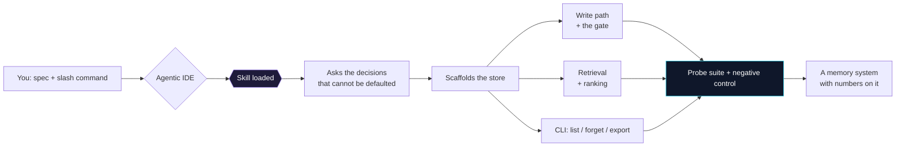
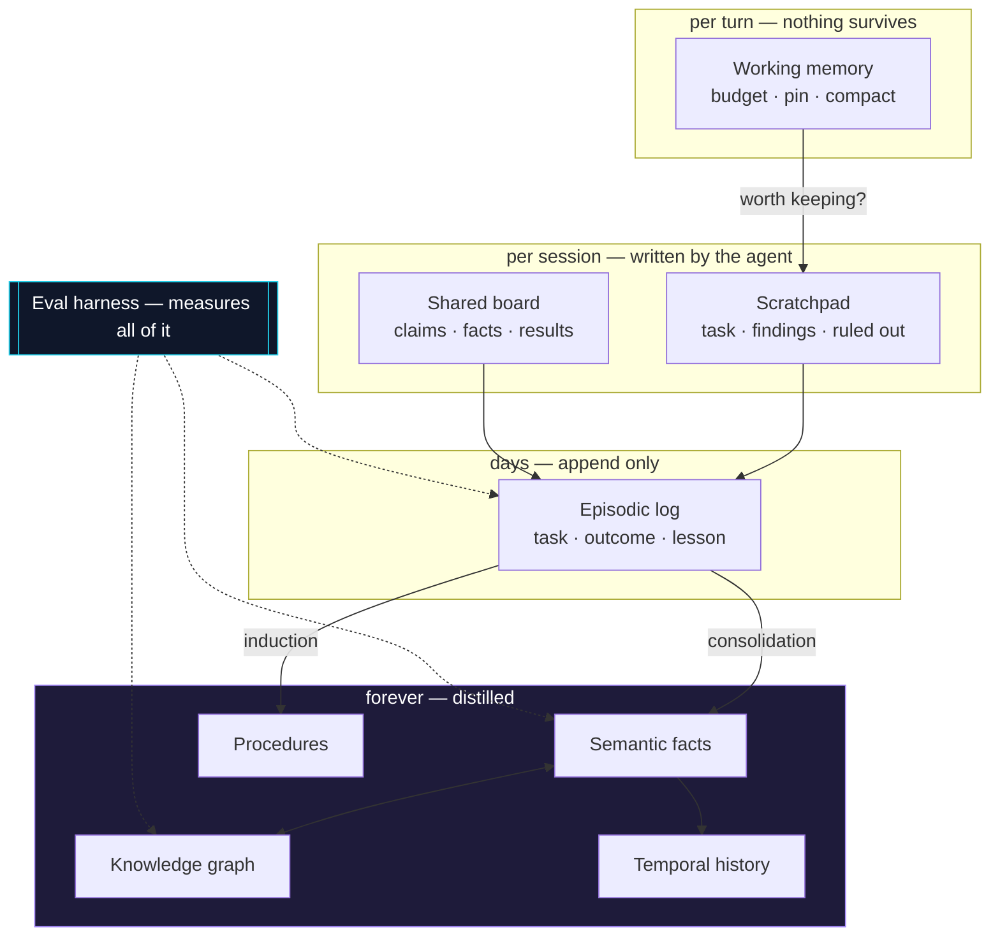
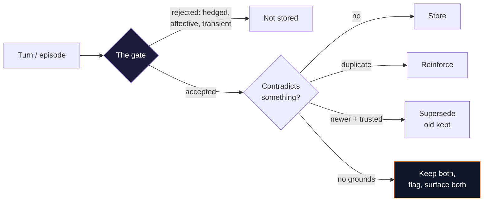

<div align="center">


# 🧠 agent-memory-skills

**A library of IDE skills for building an agent's memory.**

Not the harness — the part that *remembers*. Feed any agentic IDE
— [opencode](https://opencode.ai), Claude Code, or similar — a slash command
*plus your spec*, and it builds the memory system you asked for: working memory,
episodic logs, distilled facts, learned playbooks, knowledge graphs, bitemporal
history, consolidation, scratchpads, shared blackboards, and the eval harness
that proves any of it works.

[](LICENSE)
[](#the-skills)
[](#install)
[](#install)
[](#contributing)

*Companion to [agent-harness-skills](https://github.com/ArttuAn/agent-harness-skills) —
that repo builds the loop, this one builds what the loop remembers.*

</div>

## How it works

You teach your IDE once (install the skills), then building memory is a single
command:

```text
"using the memory-episodic skill, give my deploy agent a log of what it has
 tried before, outcomes verified by the CI exit code, so it stops repeating
 the same three failures"
```

The skill takes over: it asks the questions that decide the design, scaffolds the
whole thing — store, extraction, retrieval, CLI — and then *measures* it, because
a memory system that is never measured fails silently by construction.



## The skills

| Memory | Skill name | Claude command | What it builds |
| ------ | ---------- | -------------- | -------------- |
|  Working | `memory-working` | `/memory-working` | Token budget, pinned turns, compaction, eviction — the context window as a managed resource |
| 📓 Episodic | `memory-episodic` | `/memory-episodic` | Append-only log of what happened, with verified outcomes, recalled by similarity × recency |
| 💡 Semantic | `memory-semantic` | `/memory-semantic` | Distilled facts behind an extraction gate, entity-keyed, with four-way contradiction resolution |
| 🔁 Procedural | `memory-procedural` | `/memory-procedural` | Playbooks induced from repeated episodes, precondition-matched, demoted when they stop working |
| 🕸️ Graph | `memory-graph` | `/memory-graph` | Entity–relation graph with conservative resolution and budgeted seed-and-traverse retrieval |
| ⏳ Temporal | `memory-temporal` | `/memory-temporal` | Bitemporal facts — valid time *and* belief time — so "why did it say that in March?" is a query |
| ♻️ Consolidation | `memory-consolidation` | `/memory-consolidation` | The background pump: merge, promote, decay, prune — with lineage, dry runs and crash safety |
| 📝 Scratchpad | `memory-scratchpad` | `/memory-scratchpad` | A structured notes file the agent patches each turn — atomic, diffable, human-editable |
| 🧑‍🤝‍🧑 Shared | `memory-shared` | `/memory-shared` | Multi-agent blackboard: namespaces, CAS writes, leases with fencing tokens |
| 📊 Eval | `memory-eval` | `/memory-eval` | Probe suites, recall@k, staleness, leak gates, negative controls, longitudinal drift |

## The tiers, and how they fit

The types are not alternatives. A mature system runs several at once, with
different lifetimes, and **consolidation is the pump between them**.



**Start at the top.** Working memory plus a scratchpad is a few hundred lines,
no embeddings, no database, and it solves the complaint that produced the
request — "it forgets what we decided" — in the overwhelming majority of cases.
Everything below that line is machinery bought to solve a specific problem.
`references/choosing-a-memory.md` is the map, including when each one is the
*wrong* answer.

## The write path is the design

Retrieval gets the attention. The write path decides whether there is anything
worth retrieving — and it is where every skill here puts its guards.



Most candidates should be rejected. Contradictions should never be resolved
silently. Nothing should be deleted that could be superseded instead. Those
three rules are most of what separates a memory system from a store of
confidently-asserted noise.

## Install

Clone the repo, then run `install.sh` (no root needed):

```bash
git clone https://github.com/ArttuAn/agent-memory-skills.git
cd agent-memory-skills
./install.sh                          # global: ~/.config/opencode/skills + ~/.claude/commands
./install.sh --project                # or local: .opencode/skills + .claude/commands
```

`install.sh` spots you: skills land in your opencode config (with the shared
`references/` copied alongside each one, since the skills cite them by relative
path), commands land in your Claude Code config. `--opencode-dir` /
`--claude-dir` point anywhere.

## Usage

In **opencode**, invoke a skill by name together with your spec:

```text
memory-semantic: my assistant keeps re-asking things I already told it. Facts
worth keeping are my tooling preferences and project conventions; never store
moods or anything I hedge. Postgres-free, single user, SQLite is fine.
```

In **Claude Code** (after install), the same thing as a slash command:

```text
/memory-semantic my assistant keeps re-asking things I already told it. Facts
worth keeping are my tooling preferences and project conventions; never store
moods or anything I hedge.
```

Every skill:

- **Asks the decisions that cannot be defaulted** — what counts as a fact, what
  one episode is, what is allowed to be destroyed. These are the questions that
  determine whether the system works, and they are not inferable from a spec.
- **Says when *not* to build it.** Every skill opens with the case against
  itself. Four of the ten will regularly tell you to build something simpler.
- **Scaffolds a complete, idiomatic project** (`pyproject.toml`, `src` layout,
  env-based config, CLI).
- **Uses only the `openai` SDK plus the Python stdlib** — SQLite, hand-rolled
  cosine, `float32` BLOBs. No vector DB, no langchain, no numpy. Runs against
  any OpenAI-compatible endpoint (OpenAI, Ollama, vLLM, LM Studio).
- **Ships an offline embedder**, so the whole test suite runs in milliseconds
  with no network and no key.
- **Measures itself** — a probe suite, five metrics, and a negative control that
  proves the probes are testing the memory rather than the model's priors.

## The shared contracts

Six documents the skills cite rather than restate. Worth reading on their own:

| Reference | What it settles |
| --- | --- |
| [`choosing-a-memory.md`](references/choosing-a-memory.md) | Which type you need, when each is the wrong answer, which combinations work |
| [`store-seam.md`](references/store-seam.md) | The four types every skill shares, the offline embedder, why SQLite and not a vector DB |
| [`retrieval-quality.md`](references/retrieval-quality.md) | Composite scoring, MMR, query rewriting, hybrid search, how to inject memory honestly |
| [`forgetting.md`](references/forgetting.md) | Decay, eviction, supersession, deletion — in that order, and why the order matters |
| [`privacy.md`](references/privacy.md) | Scope as a primary key, write-time redaction, consent per fact, memory as an injection surface |
| [`evaluation.md`](references/evaluation.md) | The verification contract: three tiers, the metrics, the negative control |

## Anatomy of a skill

```text
skills/episodic/
  SKILL.md                  # Theory, the decisions, inline code, failure modes, tests
commands/memory-episodic.md # Claude Code slash-command edition of the same skill
references/*.md             # Shared contracts, cited by every skill
```

SKILL.md files follow the standard frontmatter contract so both opencode and
Claude Code can load them:

```yaml
---
name: memory-episodic
description: "Build an episodic memory: an append-only log of what the agent did, with outcomes, recalled by similarity and recency"
---
```

Every skill carries the same six sections, and CI enforces it:

`## Use this when` · `## Workflow` · `## The decisions that matter` ·
`## Failure modes` · `## Required tests` · `## Verify`

## Creating a new skill

Checklist for adding a memory type:

1. Pick a directory under `skills/` and name the skill `memory-<directory>`.
2. Open with **when not to use it**. A skill that cannot argue against itself is
   a sales page.
3. `## The decisions that matter` is the load-bearing section: the choices a
   frontier model will not make correctly from a bare spec, with the tradeoff
   stated and a recommendation given.
4. Inline, ready-to-paste Python for every module. Deps: `openai` + stdlib only.
5. `## Failure modes` and `## Required tests` must correspond — every failure
   mode worth naming should have a test that would catch it.
6. Cite `references/evaluation.md` in `## Verify` rather than restating it.
7. Add a matching `commands/memory-<directory>.md`.
8. Run `python3 tools/check_skills.py` — it compiles every code block, validates
   frontmatter and sections, and checks that every reference link resolves.

## Contributing

New memory types, better code, tighter verifications — all welcome. Open a PR
against `main`; keep the conventions above and make sure `tools/check_skills.py`
passes before submitting.

## License

[MIT](LICENSE) — do anything you like, attribute politely.
